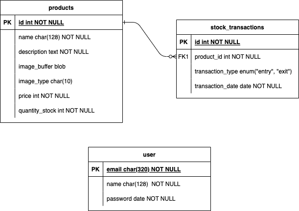

# Backend Sistema de Estoque

> ## Features

- O Sistema deve registrar, visualizar, editar e remover produtos
- Armazenar a entrada e saídas dos produtos
- login e cadastro de usuários

> ## Modelo do Banco de dados



> ## Ferramentas

- Node.js: LTS version 20.12
- Express
- MySQL
- PrismaORM
- Bcrypt
- Docker
- Jest

> ## Instruções para Executar o Projeto

1. Certifique-se de ter o Node.js instalado na sua máquina. Você pode baixá-lo em [nodejs.org](https://nodejs.org).

2. Instale as dependências do projeto:

   ```bash
   npm install
   ```

3. Configure as variáveis de ambiente:

   - Renomeie o arquivo `.env.example` para `.env`.
   - Preencha as variáveis de ambiente no arquivo `.env` com as informações corretas.
   - com comando `docker-compose up -d` dá pra subir um banco mysql

4. Execute as migrações do banco de dados:

   ```bash
   npx prisma migrate dev
   ```

5. Inicie o servidor:

   ```bash
   npm start
   ```

6. O servidor estará em execução em `http://localhost:3333`.
